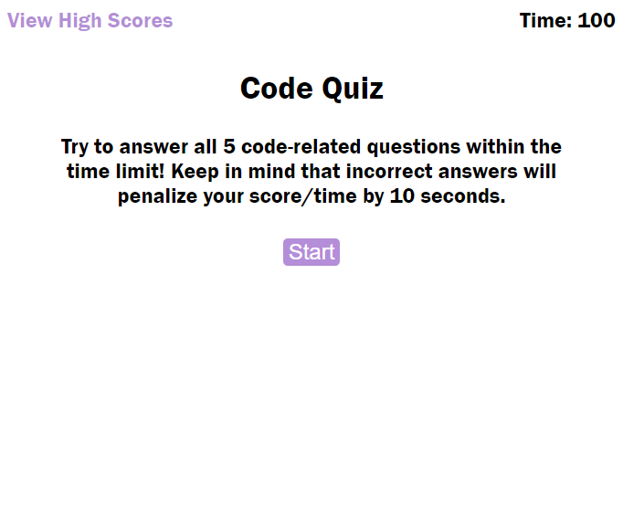

# Code Quiz 

This web application quizzes students and job applicants on their knowledge of JavaScript fundamentals. With a built-in local storage feature, it is also a great way of comparing the user's progress against peers.

Special attention was given to Web API functionality to enhance application interactivity.

## Usage

The code quiz can be accessed [here](https://colcob98.github.io/code-quiz/index.html).

A preview can be seen below:

## Contributions

Questions and answer choices were received from UNC Bootcamp's example of this project.

Assistance was provided by Learning Assistant Rudie at AskBCS in pushing the user's score to a potentially empty array in local storage.

All sound effects have a CC0 license and are attributed below:

"Ding! idea" - https://pixabay.com/sound-effects/ding-idea-40142/

"negative_beeps" - https://pixabay.com/sound-effects/negative-beeps-6008/